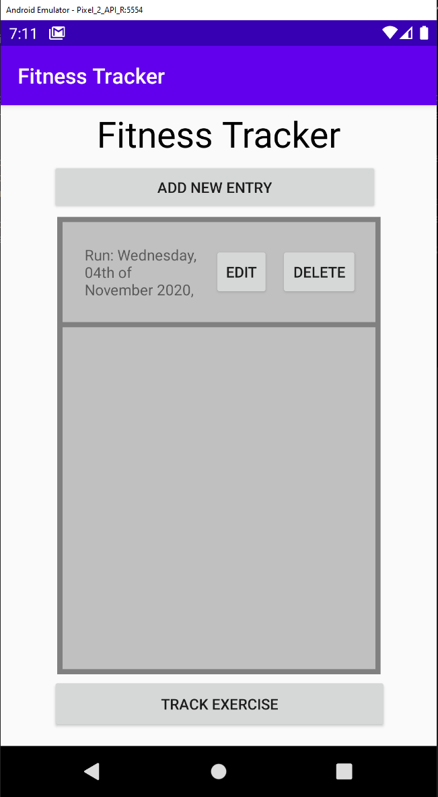
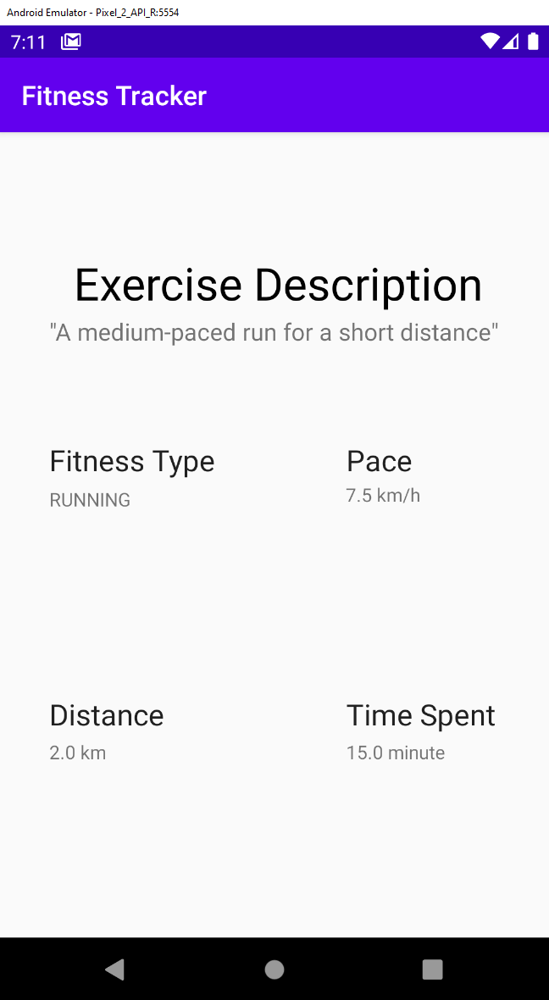
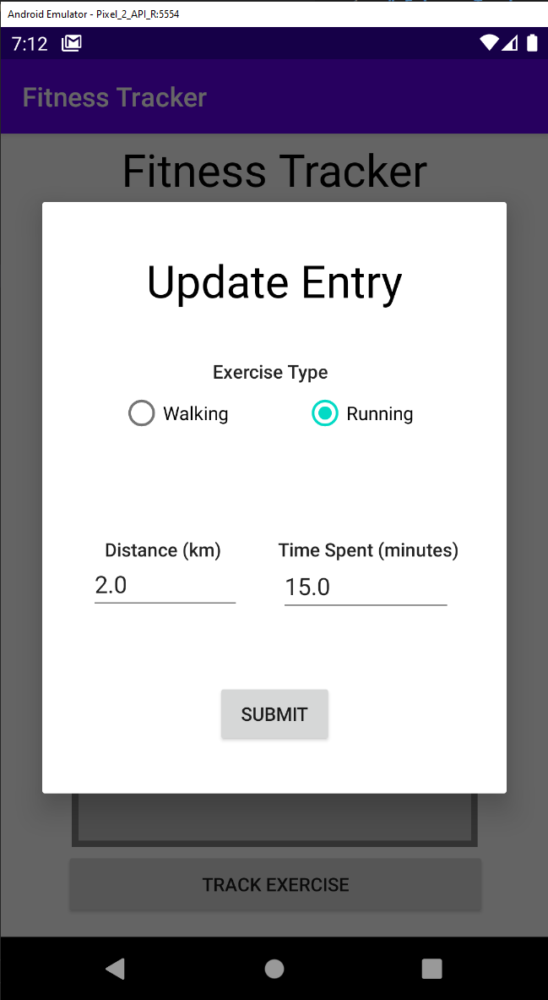
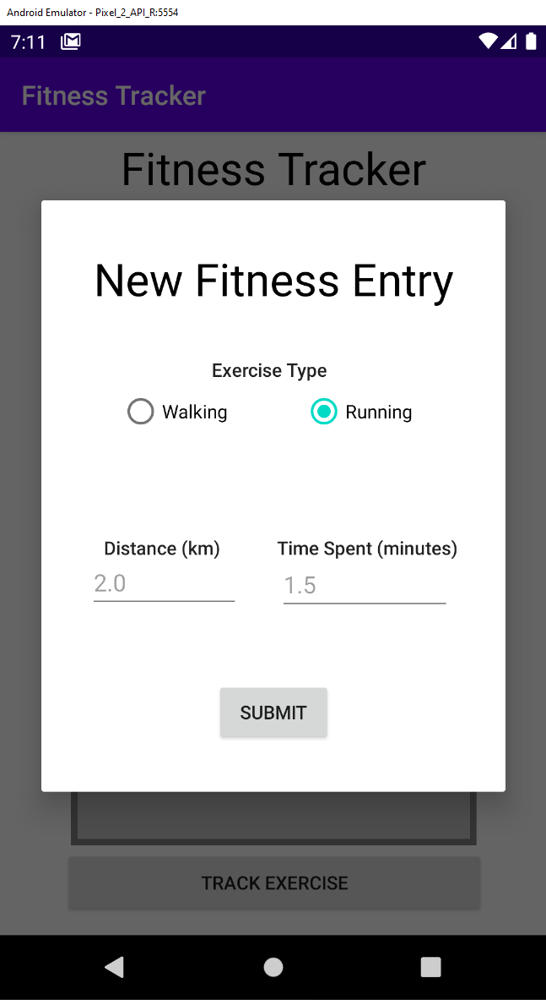

# Fitness Tracker

This is an Android application developed in Kotlin as per my University requirements to complete a custom project for a High Distinction grade. 

It is a CRUD application that allows it's users to store and manipulate a list of cardio related exercise entries. Each entry represents an entity / dataclass that stores information regarding pace, distance, the cardio activity type and so forth.

Users are able to also dynamically generate runs by pressing the track button twice. The application will generate an entry based on the distance covered between button presses and the time passed.

It utilizes an SQLite database for persistence through the Room framework, and it's high-level classes are wired together using the Dagger 2 Dependency Injection framework. 

## Screenshots

##### Figure 1, Main Activity

##### Figure 2, Detailed Activity

##### Figure 3, Edit Entry Modal

##### Figure 4, New Entry Modal